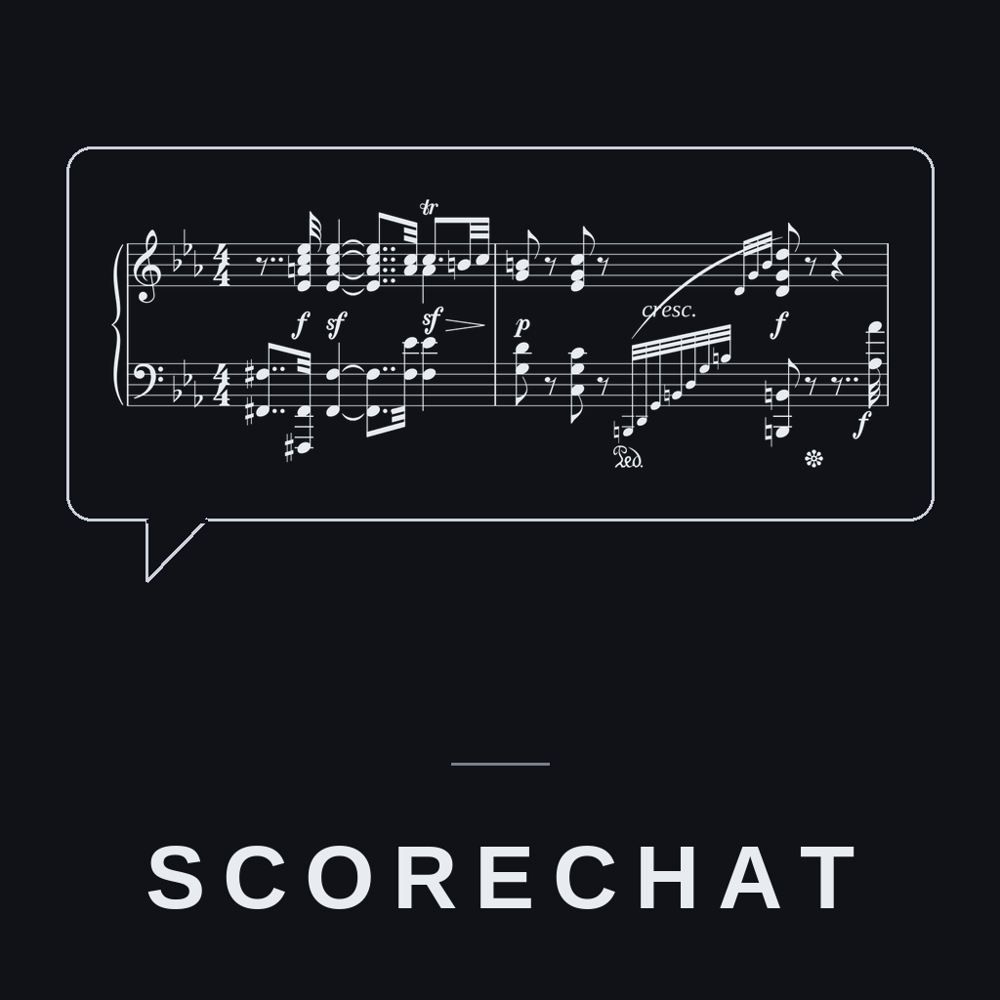
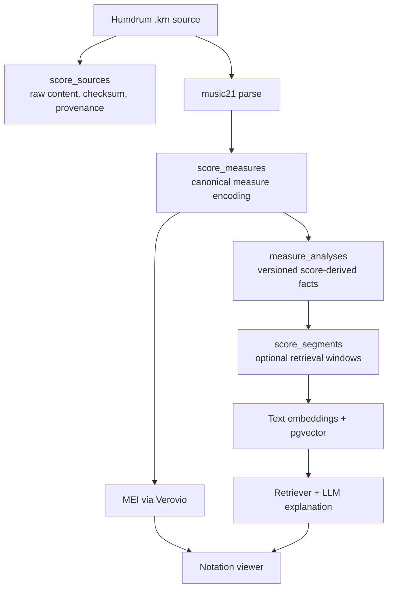

# ScoreChat — Classical Score RAG (Humdrum Edition)



ScoreChat is a symbolic-score analysis and retrieval system for classical piano music in **Humdrum (`*.krn`)** format. It preserves the source notation, derives reproducible musical facts from it, and uses retrieval and an LLM only to help locate and explain evidence-backed score passages.

The system downloads Humdrum scores directly from the [craigsapp/beethoven-piano-sonatas](https://github.com/craigsapp/beethoven-piano-sonatas) repository, preserves their raw symbolic source and checksum, encodes each notated measure through `music21`, and stores versioned measure-level analysis alongside optional retrieval embeddings in PostgreSQL with `pgvector`. A web client renders retrieved notation slices dynamically via the **Verovio** WASM toolkit in the browser.

---

## Architecture



The raw score and deterministic symbolic layers are the source of musical
evidence. Retrieval narrows passages for a question; it does not replace the
underlying notation or create analytical facts.

---

## Features

- **High-Quality Symbolic Ingestion**: Pulls verified Humdrum (`.krn`) files directly from GitHub.
- **Score-Derived Analysis**: Uses `music21` to create canonical measure encodings and versioned key, harmony, rhythm, and texture candidates.
- **WASM Notation Rendering**: Generates MEI (`.mei`) files via `verovio` python bindings so that the frontend can dynamically render exact SVG notation slices of the retrieved measures.
- **Hybrid Vector Retrieval**: Combines `pgvector` similarity search on musical analytical summaries with metadata filtering.
- **Double Interface**: Offers both a clean **Streamlit chatbot** and a customized split-screen **HTML/JS frontend** served via a Python HTTP server.

## Symbolic Score Data Model

ScoreChat keeps symbolic notation as its analytical source of truth. Embeddings
are optional retrieval aids; they do not replace score data or determine the
musical analysis.

- `score_sources` retains the exact Humdrum content, SHA-256 checksum, local
  path, and upstream source URL. This is the authoritative source for details
  not represented by a parser.
- `score_measures` stores a JSON-safe encoding of each measure across all
  parts: note/chord/rest events, pitch spellings and MIDI values, offsets,
  durations, ties, articulations, expressions, signatures, directions, and
  barlines.
- `measure_analyses` stores versioned, reproducible calculations from those
  measures: pitch classes, rhythm values, note/rest/chord counts, directions,
  key candidates, Roman-numeral candidates, and texture. Key and texture
  candidates currently use the primary part and identify that scope in the
  stored analysis.
- `analysis_runs` records the analyser, version, configuration, and source
  checksum for each broader analysis pass.
- `span_analyses` stores variable-length, evidence-backed candidates and later
  phrase/theme/variation/transition claims. The initial analyser only creates
  `candidate` spans at meter changes, notated directions, and structural
  barlines; it does not infer formal labels.
- `span_relations` records relations between spans, such as repetition,
  variation, inversion, diminution, augmentation, or meter change. No
  relations are generated until a symbolic comparison analyser is added.

Span analyses and relations have a review lifecycle: `proposed`, `accepted`,
or `rejected`. The current pipeline creates only `proposed` analytical claims;
the user interface does not yet expose review controls. A future UI should let
users inspect each claim's score evidence and explicitly accept or reject it
without changing the underlying source notation.

Form, theme, variation, and motif relationships are intentionally not asserted
in these first layers. They should be added later as evidence-backed analyses
of the preserved score data, rather than as ungrounded metadata or embedding
output.

---

## Quickstart

### 1. Set Up Environment
Create a virtual environment and install the required dependencies (requires `uv` for speed):
```bash
uv venv
source .venv/bin/activate
uv pip install -e .
```

### 2. Launch the Vector Database
Launch the local PostgreSQL database preloaded with `pgvector` (requires Docker):
```bash
docker compose up -d
```

If the database was created before the symbolic layers were added, apply the
one-time migration before ingesting again:

```bash
psql "$DATABASE_URL" -f db/migrations/001_symbolic_layers.sql
psql "$DATABASE_URL" -f db/migrations/002_span_analysis.sql
```

To rebuild only the symbolic source, measure encodings, and measure analyses
without regenerating MEI files or embeddings, use:

```bash
python ingest_scores.py --symbolic-only
```

### 3. Add API Keys
Copy the example environment file and add your `OPENAI_API_KEY`:
```bash
cp .env.example .env
# Edit .env to add your API key
```

### 4. Ingest Repertoire
Download the Beethoven piano sonata Humdrum files and index them into the database:
```bash
# Download Humdrum files (defaults to Sonata No. 32 / Op. 111)
python download_beethoven_piano_sonatas.py --sonata 32

# Parse, analyze, and ingest the scores into postgres
python ingest_scores.py
```

### 5. Launch the Web Interface
You can run either of the two user interfaces:

* **HTML/JS Client & API Server**:
  ```bash
  python server.py
  ```
  Then open [http://localhost:8000](http://localhost:8000) in your browser.
  
* **Streamlit Chatbot**:
  ```bash
  streamlit run scorechat_app.py
  ```

---

## Project Structure

```
scorechat/
├── data/
│   ├── sonata32-1.krn            # Raw Humdrum score downloaded from GitHub
│   ├── sonata32-1.musicxml       # Auto-generated standard MusicXML
│   └── mei/
│       └── sonata32-1.mei        # Auto-generated MEI for browser SVG rendering
├── db/
│   ├── models.py                 # SQLAlchemy models for Works, Assets, and Segments
│   ├── schema.sql                # SQL schema definitions for pgvector tables
│   └── store.py                  # Database persistence and cleanup functions
├── analysis/
│   └── analyzer.py               # music21-based musical feature extraction and segmentation
├── pipeline/
│   ├── chat.py                   # RAG chat logic and LLM prompt framing
│   ├── retrieval.py              # pgvector cosine similarity score search
│   ├── embedder.py               # OpenAI text embeddings generator
│   └── mei_converter.py          # Verovio-based MusicXML-to-MEI converter
├── frontend/
│   ├── index.html                # Custom HTML/JS chat client and notation viewer
│   └── score_viewer.html         # Standalone score rendering panel
├── download_beethoven_piano_sonatas.py # Downloads .krn files from craigsapp/beethoven-piano-sonatas
├── ingest_scores.py              # Batch converts, analyzes, and indexes data/*.krn to postgres
├── server.py                     # API server and static host for the HTML/JS client
├── scorechat_app.py              # Alternative Streamlit chatbot UI
└── pyproject.toml                # Project packaging and dependencies configuration
```
